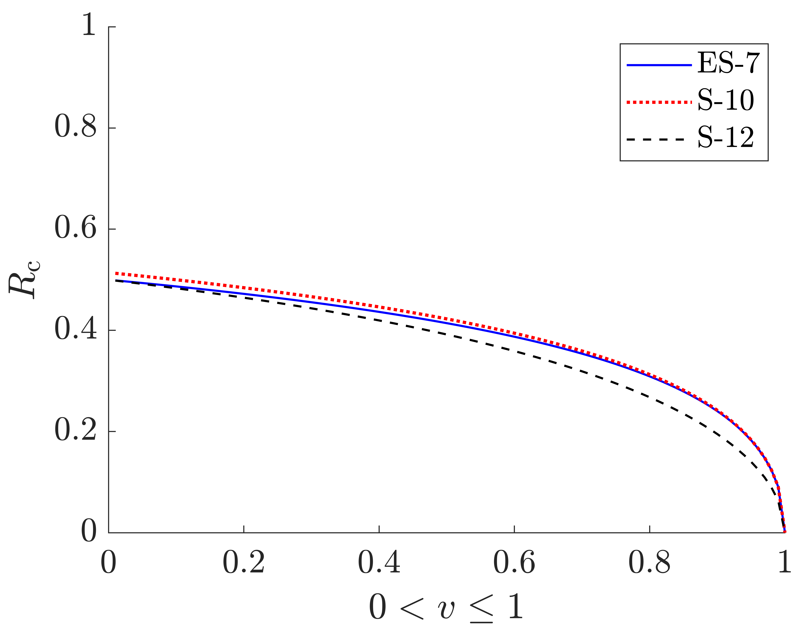
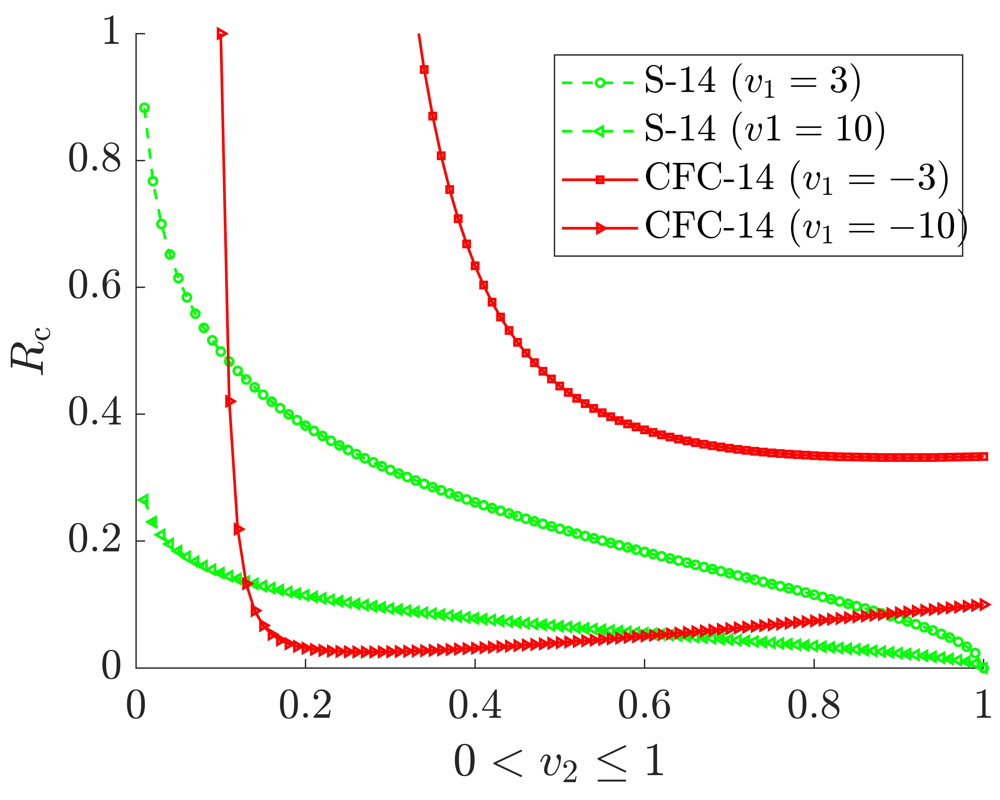

# DRX - Critical Strain for the onset of Dynamic Recrystallization
This repository contains the code for generating the two figures of the paper [A short note on approximating the critical strain for the onset of dynamic recrystallization](https://arxiv.org/abs/2310.19551). The paper provides a MATLAB code to determine the critical strain associated with the onset of dynamic recrystallization. The code takes a closed-form constitutive model and derives the critical strain by solving $\frac{\partial^2 \theta}{\partial \sigma^2}=0$. Moreover, several models that could be used for this purpose are studied. The results suggest that the most suitable model is the one proposed in the work of [Solhjoo (2014)](https://doi.org/10.1016/j.matdes.2013.08.055) for the intended purpose, which is also the only model (in its original form) that can handle initial stress ($\sigma_0$).

---

This section contains the codes and figures of the abovementeioned technical note.

```matlab
clear; close all;

x = linspace(0,1,101);
x(1) = [];

rc(:,1) = (sqrt(1-x)+x-1)./x;
rc(:,2) = 1-(2-x+sqrt((1-x).*(5-x))).^(-1/2);
rc(:,3) = 2/pi*atan(sqrt(1-x));

figure; hold on;
xlabel(' $0 < v \leq 1$ ','interpreter','latex') 
ylabel(' $R_\mathrm{c}$ ','interpreter','latex') 
plot(x,rc(:,1),'b-','DisplayName','ES-7', 'LineWidth', 1)
plot(x,rc(:,2),'r:','DisplayName','S-10', 'LineWidth', 1.5)
plot(x,rc(:,3),'k--','DisplayName','S-12', 'LineWidth', 1)
ylim([0,1]);
hl = legend('show');
set(hl, 'Interpreter','latex')
HD_g_figstyle
```



```matlab
v1 = 3; rc(:,4) = 1/v1*atanh(sqrt((1-x)./(1+x)));
v1 = 10; rc(:,5) = 1/v1*atanh(sqrt((1-x)./(1+x)));

v1 = -3; rc(:,6) = (-v1*x).^(-1./x);
v1 = -10; rc(:,7) = (-v1*x).^(-1./x);

figure; hold on;
xlabel(' $0 < v \leq 1$ ','interpreter','latex') 
ylabel(' $R_\mathrm{c}$ ','interpreter','latex')
plot(x,rc(:,4),'go--','DisplayName','S-14 $\v_\mathrm{1}=3$', 'LineWidth', 1,'MarkerSize',3)
plot(x,rc(:,5),'g<--','DisplayName','S-14 $\v_\mathrm{1}=10$', 'LineWidth', 1,'MarkerSize',3)
plot(x,rc(:,6),'r-','DisplayName','CFC-14 $\v_\mathrm{1}=-3$', 'LineWidth', 1,'MarkerSize',3,'Marker','square')
plot(x,rc(:,7),'r>-','DisplayName','CFC-14 $\v_\mathrm{1}=-10$', 'LineWidth', 1,'MarkerSize',3)
ylim([0,1]);
hl = legend('show');
set(hl, 'Interpreter','latex')
HD_g_figstyle
```


